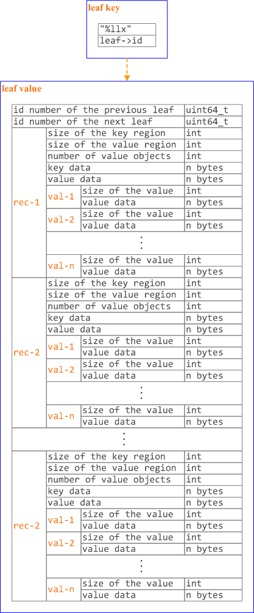

<h1 id="id_top">The B+ tree database of Tokyo Cabinet</h1>

Copyright (c) 2016

*Author: jobs*  
*Email: yao050421103@163.com*

* [API](#id_api)
    * [Performance](#id_api_perf)
    * [CRUD](#id_api_crud)
    * [Transaction](#id_api_trans)
    * [Cursor](#id_api_cursor)
    * [NOTES](#id_api_notes)
    * [Sample](#id_api_sample)
* [BDB](#id_bdb)
    * [Structs](#id_bdb_structs)
    * [Cache](#id_bdb_cache)
    * [Put](#id_bdb_tcbdbput)
    * [Persist](#id_bdb_persist)
    * [Meta Data Persistence](#id_bdb_meta)
    * [Node Data Persistence](#id_bdb_node)
    * [Leaf Data Persistence](#id_bdb_leaf)
* [Code](#id_code)
    * [tcbdbcopy](#id_code_tcbdbcopy)
    * [tcbdbmemsync](#id_code_tcbdbmemsync)
    * [tcbdbnodeload](#id_code_tcbdbnodeload)
    * [tcbdbleafkill](#id_code_tcbdbleafkill)
    * [tcbdbnodesubidx](#id_code_tcbdbnodesubidx)
    * [tcbdbsearchleaf](#id_code_tcbdbsearchleaf)
    * [tcbdbprintmeta](#id_code_tcbdbprintmeta)
    * [tcbdbleafaddrec](#id_code_tcbdbleafaddrec)
    * [tcbdbleafsave](#id_code_tcbdbleafsave)
    * [tcbdbleafload](#id_code_tcbdbleafload)
    * [tcbdbnodesave](#id_code_tcbdbnodesave)
    * [tcbdbnodeload](#id_code_tcbdbnodeload)
    * [tcbdbdumpmeta](#id_code_tcbdbdumpmeta)
    * [tcbdbloadmeta](#id_code_tcbdbloadmeta)
    * [tcbdbtranbegin](#id_code_tcbdbtranbegin)
    * [tcbdbtrancommit](#id_code_tcbdbtrancommit)
    * [tcbdbleafcacheout](#id_code_tcbdbleafcacheout)
    * [tcbdbopenimpl](#id_code_tcbdbopenimpl)
    * [tcbdbcloseimpl](#id_code_tcbdbcloseimpl)
    * [tcbdbcacheclear](#id_code_tcbdbcacheclear)
    * [tcbdbcacheadjust](#id_code_tcbdbcacheadjust)
    * [tcbdbforeachimpl](#id_code_tcbdbforeachimpl)
    * [TCSETVNUMBUF](#id_code_tcsetvnumbuf)
    * [TCSETVNUMBUF64](#id_code_id_code_tcsetvnumbuf64)
    * [TCREADVNUMBUF](#id_code_tcreadvnumbuf)
    * [TCREADVNUMBUF64](#id_code_tcreadvnumbuf64)

<h2 id="id_api">API</h2>

<h3 id="id_api_perf">Performance</h3>

#### tcbdbtune & tcbdboptimize ####

The function `tcbdbtune` is used in order to set the tuning parameters of a B+ tree database object.

    
    bool tcbdbtune(TCBDB *bdb, int32_t lmemb, int32_t nmemb, int64_t bnum, int8_t apow, int8_t fpow, uint8_t opts);

    # lmemb: 每个叶子节点包含的成员数，默认值128
    # nmemb: 每个非叶子节点包含的成员数，默认值256
    # bnum: bucket数组的元素个数，默认值32749，推荐值：存储的所有的页数的1-4倍
    # apow: 记录对齐的单位，默认值8 => 2^8=256
    # fpow: 指定free block pool的元素的最大数量，默认值10 => 2^10=1024
    # opts: 可选项.
        BDBTLARGE: 数据库大小可以超过2GB, 使用64位的bucket array
        BDBTDEFLATE: 每一页按Deflate编码方式压缩
        BDBTBZIP: 每一页按BZIP2编码方式压缩
        BDBTTCBS: 每一页按TCBS编码方式压缩

* `bdb` specifies the B+ tree database object which is **not opened**.
* `lmemb` specifies the number of members in each leaf page. If it is not more than 0, the default value is specified. The default value is 128.
* `nmemb` specifies the number of members in each non-leaf page. If it is not more than 0, the default value is specified. The default value is 256.
* `bnum` specifies the number of elements of the bucket array. If it is not more than 0, the default value is specified. The default value is 32749. Suggested size of the bucket array is about from 1 to 4 times of the number of all pages to be stored.
* `apow` specifies the size of record alignment by power of 2. If it is negative, the default value is specified. The default value is 8 standing for 2^8=256.
* `fpow` specifies the maximum number of elements of the free block pool by power of 2. If it is negative, the default value is specified. The default value is 10 standing for 2^10=1024.
* `opts` specifies options by bitwise-or: `BDBTLARGE` specifies that the size of the database can be larger than 2GB by using 64-bit bucket array, `BDBTDEFLATE` specifies that each page is compressed with Deflate encoding, `BDBTBZIP` specifies that each page is compressed with BZIP2 encoding, `BDBTTCBS` specifies that each page is compressed with TCBS encoding.

If successful, the return value is true, else, it is false.  
Note that the tuning parameters should be set **before the database is opened**.

    bool tcbdboptimize(TCBDB *bdb, int32_t lmemb, int32_t nmemb, int64_t bnum, int8_t apow, int8_t fpow, uint8_t opts);
    # This function is useful to reduce the size of the database file with data fragmentation by successive updating.

* `bdb` specifies the B+ tree database object **connected as a writer**.

[回顶部](#id_top)

#### tcbdbsetcache ####

The function `tcbdbsetcache' is used in order to set the caching parameters of a B+ tree database object.

    bool tcbdbsetcache(TCBDB *bdb, int32_t lcnum, int32_t ncnum);

    # lcnum: 缓存的叶子节点数量. 默认值1024
    # ncnum: 缓存的非叶子节点数量. 默认值512

* `bdb` specifies the B+ tree database object which is **not opened**.
* `lcnum` specifies the maximum number of leaf nodes to be cached. If it is not more than 0, the default value is specified. The default value is 1024.
* `ncnum` specifies the maximum number of non-leaf nodes to be cached. If it is not more than 0, the default value is specified. The default value is 512.

If successful, the return value is true, else, it is false.

Note that the caching parameters should be set **before the database is opened**.

[回顶部](#id_top)

#### tcbdbsetxmsiz ####

The function `tcbdbsetxmsiz` is used in order to **set the size of the extra mapped memory** of a B+ tree database object.

    bool tcbdbsetxmsiz(TCBDB *bdb, int64_t xmsiz);

* `bdb` specifies the B+ tree database object which is **not opened**.
* `xmsiz` specifies the size of the extra mapped memory. If it is not more than 0, the extra mapped memory is disabled. It is **disabled by default**.

If successful, the return value is true, else, it is false.

Note that the mapping parameters should be set **before the database is opened**.

[回顶部](#id_top)

#### tcbdbsetdfunit ####

The function `tcbdbsetdfunit` is used in order to set **the unit step number of auto defragmentation** of a B+ tree database object.

    bool tcbdbsetdfunit(TCBDB *bdb, int32_t dfunit);

* `bdb` specifies the B+ tree database object which is not opened.
* `dfunit` specifie the unit step number. If it is not more than 0, the auto defragmentation is disabled. It is **disabled by default**.

If successful, the return value is true, else, it is false.

Note that the defragmentation parameter should be set **before the database is opened**.

[回顶部](#id_top)

<h3 id="id_api_crud">CRUD</h3>

#### tcbdbopen ####

The function `tcbdbopen` is used in order to open a database file and connect a B+ tree database object.

    bool tcbdbopen(TCBDB *bdb, const char *path, int omode);
    # omode: BDBOWRITER | BDBOREADER
        BDBONOLCK : 打开数据库文件，但不锁定
        BDBOLCKNB : 锁定数据库，不阻塞

        BDBOWRITER
            BDBOCREAT : 如果不存在，创建
            BDBOTRUNC : 不管存不存在，都创建
            BDBOTSYNC : 每一次事务都同步更新磁盘的内容

* `bdb` specifies the B+ tree database object which is not opened.
* `path` specifies the path of the database file.
* `omode` specifies the connection mode: `BDBOWRITER` as a writer, `BDBOREADER` as a reader. If the mode is `BDBOWRITER`, the following may be added by bitwise-or: `BDBOCREAT`, which means it creates a new database if not exist, `BDBOTRUNC`, which means it creates a new database regardless if one exists, `BDBOTSYNC`, which means every transaction synchronizes updated contents with the device. Both of `BDBOREADER` and `BDBOWRITER` can be added to by bitwise-or: `BDBONOLCK`, which means it opens the database file without file locking, or `BDBOLCKNB`, which means locking is performed without blocking.

If successful, the return value is true, else, it is false.

[回顶部](#id_top)

#### tcbdbclose ####

The function `tcbdbclose` is used in order to close a B+ tree database object.

    bool tcbdbclose(TCBDB *bdb);

    # 关闭数据库后，所有的内容都将被同步到磁盘

* `bdb` specifies the B+ tree database object.

If successful, the return value is true, else, it is false.

Update of a database is assured to be written when the database is closed. If a writer opens a database but does not close it appropriately, **the database will be broken**.

[回顶部](#id_top)

#### tcbdbput ####

    bool tcbdbput(TCBDB *bdb, const void *kbuf, int ksiz, const void *vbuf, int vsiz);
    # If a record with the same key exists in the database, it is overwritten.

    bool tcbdbputkeep(TCBDB *bdb, const void *kbuf, int ksiz, const void *vbuf, int vsiz);
    # If a record with the same key exists in the database, this function has no effect.

    bool tcbdbputcat(TCBDB *bdb, const void *kbuf, int ksiz, const void *vbuf, int vsiz);
    # concatenate a value at the end of the existing record
    # If there is no corresponding record, a new record is created.

    bool tcbdbputdup(TCBDB *bdb, const void *kbuf, int ksiz, const void *vbuf, int vsiz);
    # store a record with allowing duplication of keys.
    # If a record with the same key exists in the database, the new record is placed after the existing one.

    bool tcbdbputdup3(TCBDB *bdb, const void *kbuf, int ksiz, const TCLIST *vals);
    # store records with allowing duplication of keys.
    # If a record with the same key exists in the database, the new records are placed after the existing one.

    int tcbdbaddint(TCBDB *bdb, const void *kbuf, int ksiz, int num);
    # add an integer to a record

    double tcbdbadddouble(TCBDB *bdb, const void *kbuf, int ksiz, double num);
    # add a real number to a record

[回顶部](#id_top)

#### tcbdbout & tcbdbvanish ####

    bool tcbdbout(TCBDB *bdb, const void *kbuf, int ksiz);
    # remove a record of a B+ tree database object
    # If the key of duplicated records is specified, the first one is selected.

    bool tcbdbout3(TCBDB *bdb, const void *kbuf, int ksiz);
    # remove records of a B+ tree database object.
    # If the key of duplicated records is specified, all of them are removed.

    bool tcbdbvanish(TCBDB *bdb);
    # remove all records of a B+ tree database object

[回顶部](#id_top)

#### tcbdbsync ####

    bool tcbdbsync(TCBDB *bdb);
    # synchronize updated contents of a B+ tree database object with the file and the device.
    # This function is useful when another process connects to the same database file.

[回顶部](#id_top)

#### tcbdbget ####

    void *tcbdbget(TCBDB *bdb, const void *kbuf, int ksiz, int *sp);
    # retrieve a record in a B+ tree database object
    # If the key of duplicated records is specified, the first one is selected.
    [NOTE] Because an additional zero code is appended at the end of the region of the return value, the return value can be treated as a character string.  
    [WARNING] Because the region of the return value is allocated with the `malloc` call, it should be released with the `free` call when it is no longer in use.  

    const void *tcbdbget3(TCBDB *bdb, const void *kbuf, int ksiz, int *sp);
    [WARNING] the region of the return value is volatile and it may be spoiled by another operation of the database, the data should be copied into another involatile buffer immediately.

    TCLIST *tcbdbget4(TCBDB *bdb, const void *kbuf, int ksiz);
    # retrieve records in a B+ tree database object
    [WARNING] Because the object of the return value is created with the function `tclistnew`, it should be deleted with the function `tclistdel` when it is no longer in use.

[回顶部](#id_top)

#### tcbdbvnum ####

    int tcbdbvnum(TCBDB *bdb, const void *kbuf, int ksiz);
    # get the number of records corresponding a key

[回顶部](#id_top)

#### tcbdbvsiz ####

    int tcbdbvsiz(TCBDB *bdb, const void *kbuf, int ksiz);
    # get the size of the value of a record

[回顶部](#id_top)

#### tcbdbrange ####

    TCLIST *tcbdbrange(TCBDB *bdb, const void *bkbuf, int bksiz, bool binc, const void *ekbuf, int eksiz, bool einc, int max);
    # get keys of ranged records

* `bdb` specifies the B+ tree database object.
* `bkbuf` specifies the pointer to the region of the key of the beginning border. If it is `NULL`, the first record is specified.
* `bksiz` specifies the size of the region of the beginning key.
* `binc` specifies whether the beginning border is inclusive or not.
* `ekbuf` specifies the pointer to the region of the key of the ending border. If it is `NULL`, the last record is specified.
* `eksiz` specifies the size of the region of the ending key.
* `einc` specifies whether the ending border is inclusive or not.
* `max` specifies the maximum number of keys to be fetched. If it is negative, **no limit is specified**.

The return value is a list object of the keys of the corresponding records. This function does never fail. It returns an **empty list** even if no record corresponds.

Because the object of the return value is created with the function `tclistnew`, **it should be deleted with the function `tclistdel` when it is no longer in use**.

[回顶部](#id_top)

#### tcbdbfwmkeys ####

    TCLIST *tcbdbfwmkeys(TCBDB *bdb, const void *pbuf, int psiz, int max);
    # get forward matching keys

* `bdb` specifies the B+ tree database object.
* `pbuf` specifies the pointer to the region of the prefix.
* `psiz` specifies the size of the region of the prefix.
* `max` specifies the maximum number of keys to be fetched. If it is negative, no limit is specified.

The return value is a list object of the corresponding keys. This function does never fail. It returns an **empty list** even if no key corresponds.

Because the object of the return value is created with the function `tclistnew`, **it should be deleted with the function `tclistdel` when it is no longer in use**.

[回顶部](#id_top)

#### tcbdbpath ####

    const char *tcbdbpath(TCBDB *bdb);
    # get the file path of a B+ tree database object

[回顶部](#id_top)

#### tcbdbfsiz ####

    uint64_t tcbdbfsiz(TCBDB *bdb);
    # get the size of the database file

[回顶部](#id_top)

#### tcbdbrnum ####

    uint64_t tcbdbrnum(TCBDB *bdb);
    # get the number of records

[回顶部](#id_top)

#### tcbdbcopy ####

    bool tcbdbcopy(TCBDB *bdb, const char *path);

* `bdb` specifies the B+ tree database object.
* `path` specifies the path of the destination file. If it begins with `@`, the trailing substring is executed **as a command line**.

If successful, the return value is true, else, it is false. False is returned if the executed command returns non-zero code.  

The database file is assured to be kept **synchronized** and **not modified** while the copying or executing operation is in progress. So, this function is useful to **create a backup file** of the database file.

[回顶部](#id_top)

<h3 id="id_api_trans">Transaction</h3>

#### tcbdbtranbegin ####

    bool tcbdbtranbegin(TCBDB *bdb);

The database is **locked by the thread** while the transaction so that only one transaction can be activated with a database object at the same time. Thus, the **serializable isolation** level is assumed if every database operation is performed in the transaction. Because** all pages are cached on memory** while the transaction, **the amount of referred records is limited by the memory capacity**. If the database is closed during transaction, the transaction is aborted implicitly.

[回顶部](#id_top)

#### tcbdbtrancommit ####

    bool tcbdbtrancommit(TCBDB *bdb);
    # Update in the transaction is fixed when it is committed successfully.

[回顶部](#id_top)

#### tcbdbtranabort ####

    bool tcbdbtranabort(TCBDB *bdb);
    # Update in the transaction is discarded when it is aborted. The state of the database is rollbacked to before transaction.

[回顶部](#id_top)

<h3 id="id_api_cursor">Cursor</h3>

### tcbdbcurnew ###

    BDBCUR *tcbdbcurnew(TCBDB *bdb);

the cursor is available only after initialization with the `tcbdbcurfirst` or the `tcbdbcurjump` functions and so on. Moreover, the position of the cursor will be **indefinite** when the database is updated after the initialization of the cursor.

[回顶部](#id_top)

### tcbdbcurdel ###

    void tcbdbcurdel(BDBCUR *cur);

[回顶部](#id_top)

### tcbdbcurfirst ###

    bool tcbdbcurfirst(BDBCUR *cur);

[回顶部](#id_top)

### tcbdbcurlast ###

    bool tcbdbcurlast(BDBCUR *cur);

[回顶部](#id_top)

### tcbdbcurprev ###

    bool tcbdbcurprev(BDBCUR *cur);

[回顶部](#id_top)

### tcbdbcurnext ###

    bool tcbdbcurnext(BDBCUR *cur);

[回顶部](#id_top)

### tcbdbcurjump ###

    bool tcbdbcurjump(BDBCUR *cur, const void *kbuf, int ksiz);
    # move a cursor object to the front of records corresponding a key.
The cursor is set to the first record corresponding the key or the next substitute if completely matching record does not exist.

[回顶部](#id_top)

### tcbdbcurput ###

    bool tcbdbcurput(BDBCUR *cur, const void *vbuf, int vsiz, int cpmode);
    # insert a record around a cursor object

* `cur` specifies the cursor object of writer connection.
* `vbuf` specifies the pointer to the region of the value.
* `vsiz` specifies the size of the region of the value.
* `cpmode` specifies detail adjustment: `BDBCPCURRENT`, which means that the value of the current record is **overwritten**, `BDBCPBEFORE`, which means that the new record is **inserted before** the current record, `BDBCPAFTER`, which means that the new record is **inserted after** the current record.

If successful, the return value is true, else, it is false. False is returned when the cursor is at invalid position.

After insertion, the cursor **is moved to the inserted record**.

[回顶部](#id_top)

### tcbdbcurout ###

    bool tcbdbcurout(BDBCUR *cur);
    # remove the record where a cursor object is.

After deletion, the cursor is moved to the **next record if possible**.

[回顶部](#id_top)

### tcbdbcurkey ###

    void *tcbdbcurkey(BDBCUR *cur, int *sp);
    # get the key of the record where the cursor object is

* `sp` specifies the pointer to the variable into which the size of the region of the return value is assigned.

The return value can be treated as a character string. Because the region of the return value is allocated with the `malloc` call, **it should be released with the `free` call when it is no longer in use**.

[回顶部](#id_top)

### tcbdbcurkey3 ###

    const void *tcbdbcurkey3(BDBCUR *cur, int *sp);
    # get the key of the record where the cursor object is, as a volatile buffer.

Because the region of the return value is volatile and it may be spoiled by another operation of the database, the data **should be copied into another involatile buffer immediately**.

[回顶部](#id_top)

### tcbdbcurval ###

    void *tcbdbcurval(BDBCUR *cur, int *sp);
    # get the value of the record

**It should be released with the `free` call when it is no longer in use**.

[回顶部](#id_top)

### tcbdbcurval3 ###

    const void *tcbdbcurval3(BDBCUR *cur, int *sp);
    # get the value of the record where the cursor object is, as a volatile buffer.

**The data should be copied into another involatile buffer immediately**.

[回顶部](#id_top)

### tcbdbcurrec ###

    bool tcbdbcurrec(BDBCUR *cur, TCXSTR *kxstr, TCXSTR *vxstr);
    # get the key and the value of the record where the cursor object is.

[回顶部](#id_top)

<h3 id="id_api_sample">Sample</h3>

    #include <tcutil.h>
    #include <tcbdb.h>
    #include <stdlib.h>
    #include <stdbool.h>
    #include <stdint.h>
    
    int main(int argc, char **argv)
    {
      TCBDB *bdb;
      BDBCUR *cur;
      int ecode;
      char *key, *value;
    
      /* create the object */
      bdb = tcbdbnew();
    
      /* open the database */
      if(!tcbdbopen(bdb, "casket.tcb", BDBOWRITER | BDBOCREAT)){
        ecode = tcbdbecode(bdb);
        fprintf(stderr, "open error: %s\n", tcbdberrmsg(ecode));
      }
    
      /* store records */
      if(!tcbdbput2(bdb, "foo", "hop") ||
         !tcbdbput2(bdb, "bar", "step") ||
         !tcbdbput2(bdb, "baz", "jump")){
        ecode = tcbdbecode(bdb);
        fprintf(stderr, "put error: %s\n", tcbdberrmsg(ecode));
      }
    
      /* retrieve records */
      value = tcbdbget2(bdb, "foo");
      if(value){
        printf("%s\n", value);
        free(value);
      } else {
        ecode = tcbdbecode(bdb);
        fprintf(stderr, "get error: %s\n", tcbdberrmsg(ecode));
      }
    
      /* traverse records */
      cur = tcbdbcurnew(bdb);
      tcbdbcurfirst(cur);
      while((key = tcbdbcurkey2(cur)) != NULL){
        value = tcbdbcurval2(cur);
        if(value){
          printf("%s:%s\n", key, value);
          free(value);
        }
        free(key);
        tcbdbcurnext(cur);
      }
      tcbdbcurdel(cur);
    
      /* close the database */
      if(!tcbdbclose(bdb)){
        ecode = tcbdbecode(bdb);
        fprintf(stderr, "close error: %s\n", tcbdberrmsg(ecode));
      }
    
      /* delete the object */
      tcbdbdel(bdb);
    
      return 0;
    }

[回顶部](#id_top)

<h3 id="id_api_notes">NOTES</h3>

#### tcbdbnew & tcbdbdel ####

A B+ tree database object is created with the function `tcbdbnew` and is deleted with the function `tcbdbdel`. **To avoid memory leak, it is important to delete every object when it is no longer in use**.

#### tcbdbopen & tcbdbclose ####

The function `tcbdbopen` is used to open a database file and the function `tcbdbclose` is used to close the database file. **To avoid data missing or corruption, it is important to close every database file when it is no longer in use. It is forbidden for multible database objects in a process to open the same database at the same time.**

[回顶部](#id_top)

<h2 id="id_bdb">BDB</h2>

<h3 id="id_bdb_structs">Structs</h3>

    typedef struct {                         // type of structure for a record
      int ksiz;                              // size of the key region
      int vsiz;                              // size of the value region
      TCLIST *rest;                          // list of value objects
    } BDBREC;
    
    typedef struct {                         // type of structure for a leaf page
      uint64_t id;                           // ID number of the leaf
      TCPTRLIST *recs;                       // list of records
      int size;                              // predicted size of serialized buffer
      uint64_t prev;                         // ID number of the previous leaf
      uint64_t next;                         // ID number of the next leaf
      bool dirty;                            // whether to be written back
      bool dead;                             // whether to be removed
    } BDBLEAF;
    
    typedef struct {                         // type of structure for a page index
      uint64_t pid;                          // ID number of the referring page
      int ksiz;                              // size of the key region
    } BDBIDX;
    
    typedef struct {                         // type of structure for a node page
      uint64_t id;                           // ID number of the node
      uint64_t heir;                         // ID of the child before the first index
      TCPTRLIST *idxs;                       // list of indices
      bool dirty;                            // whether to be written back
      bool dead;                             // whether to be removed
    } BDBNODE;

[回顶部](#id_top)

<h3 id="id_bdb_cache">Cache</h3>

    # TCBDB
    TCMAP *leafc; /* cache for leaves */
    TCMAP *nodec; /* cache for nodes */

使用到的接口：

* [tcbdbcopy](#id_code_tcbdbcopy)
* [tcbdbmemsync](#id_code_tcbdbmemsync)
* [tcbdbnodeload](#id_code_tcbdbnodeload)
    * [tcbdbleafkill](#id_code_tcbdbleafkill)
    * [tcbdbnodesubidx](#id_code_tcbdbnodesubidx)
    * [tcbdbsearchleaf](#id_code_tcbdbsearchleaf)
* [tcbdbprintmeta](#id_code_tcbdbprintmeta)

[回顶部](#id_top)

<h3 id="id_bdb_tcbdbput">Put</h3>

**所有的put操作都是写内存，并不直接持久化到硬盘**

* [tcbdbleafaddrec](#id_code_tcbdbleafaddrec)

[回顶部](#id_top)

<h3 id="id_bdb_persist">Persist</h3>

关键字段：

    # tcbdbopenimpl
    bdb->opaque = tchdbopaque(bdb->hdb);

#### 调用点 ####

* [tcbdbcopy](#id_code_tcbdbcopy)
* [tcbdbmemsync](#id_code_tcbdbmemsync)
    * [tcbdbtranbegin](#id_code_tcbdbtranbegin)
    * [tcbdbtrancommit](#id_code_tcbdbtrancommit)
* [tcbdbleafcacheout](#id_code_tcbdbleafcacheout)
    * [tcbdbcacheclear](#id_code_tcbdbcacheclear)
    * [tcbdbcacheadjust](#id_code_tcbdbcacheadjust)
    * [tcbdbcloseimpl](#id_code_tcbdbcloseimpl)
    * [tcbdbforeachimpl](#id_code_tcbdbforeachimpl)
* [tcbdbopenimpl](#id_code_tcbdbopenimpl)

[回顶部](#id_top)

#### 持久化到硬盘的时机 ####

* **B+树调整**
* **事务**
* **打开/关闭数据库**
* **数据库备份**
* **调用者遍历数据库**

#### 二进制结构 ####

* `meta data` 为固定64字节
* `node data` 和 `leaf data` 的持久化通过 `hdb` 的 kv 接口完成，key由每个节点的 id 经过格式化处理后生成，value通过专用的二进制格式序列化而产生。
* `node data` 和 `leaf data` 的专用二进制格式每个数字项都是 **可变长度** （数据压缩），相关的接口为：  
    * [TCSETVNUMBUF](#id_code_tcsetvnumbuf)
    * [TCSETVNUMBUF64](#id_code_id_code_tcsetvnumbuf64)
    * [TCREADVNUMBUF](#id_code_tcreadvnumbuf)
    * [TCREADVNUMBUF64](#id_code_tcreadvnumbuf64)

[回顶部](#id_top)

<h3 id="id_bdb_meta">Meta Data Persistence</h3>

* [tcbdbdumpmeta](#id_code_tcbdbdumpmeta)
* [tcbdbloadmeta](#id_code_tcbdbloadmeta)

涉及的数据: 

    # TCBDB
    TCCMP cmp; /* pointer to the comparison function */
    uint32_t lmemb; /* number of members in each leaf */
    uint32_t nmemb; /* number of members in each node */
    uint64_t root; /* ID number of the root page */
    uint64_t first; /* ID number of the first leaf */
    uint64_t last; /* ID number of the last leaf */
    uint64_t lnum; /* number of leaves */
    uint64_t nnum; /* number of nodes */
    uint64_t rnum; /* number of records */
    
    # reference
    
    # tcbdbsearchleaf
    uint64_t pid = bdb->root;
    # tcbdbcurfirstimpl
    cur->id = bdb->first;
    # tcbdbcurlastimpl
    cur->id = bdb->last;

二进制结构：

**大小**：64字节  

    memset(bdb->opaque, 0, 64);

**comparator **

* `0x0` : lexical
* `0x1` : decimal
* `0x2` : int32
* `0x3` : int64
* `0xff`: other

[回顶部](#id_top)

<h3 id="id_bdb_node">Node Data Persistence</h3>

* [tcbdbnodesave](#id_code_tcbdbnodesave)
* [tcbdbnodeload](#id_code_tcbdbnodeload)

对应的hdb接口：

    tchdbput(bdb->hdb, hbuf, step, TCXSTRPTR(rbuf), TCXSTRSIZE(rbuf))

涉及的数据: 

    # BDBNODE
    uint64_t id; // ID number of the node
    uint64_t heir; // ID of the child before the first index
    TCPTRLIST *idxs; // list of indices
    # BDBIDX
    uint64_t pid; // ID number of the referring page
    int ksiz; // size of the key region

二进制结构：
    

[回顶部](#id_top)

<h3 id="id_bdb_leaf">Leaf Data Persistence</h3>

* [tcbdbleafsave](#id_code_tcbdbleafsave)
* [tcbdbleafload](#id_code_tcbdbleafload)

对应的hdb接口：

    tchdbput(bdb->hdb, hbuf, step, TCXSTRPTR(rbuf), TCXSTRSIZE(rbuf))

涉及的数据: 

    # BDBLEAF
    uint64_t id; // ID number of the leaf
    uint64_t prev; // ID number of the previous leaf
    uint64_t next; // ID number of the next leaf
    TCPTRLIST *recs; // list of records
    # BDBREC
    int ksiz; // size of the key region
    int vsiz; // size of the value region
    TCLIST *rest; // list of value objects

二进制结构：

[回顶部](#id_top)

<h2 id="id_code">Code</h2>

<h3 id="id_code_tcbdbcopy">tcbdbcopy</h3>

    bool tcbdbcopy(TCBDB *bdb, const char *path){
      assert(bdb && path);
      if(!BDBLOCKMETHOD(bdb, true)) return false;
      if(!bdb->open){
        tcbdbsetecode(bdb, TCEINVALID, __FILE__, __LINE__, __func__);
        BDBUNLOCKMETHOD(bdb);
        return false;
      }
      BDBTHREADYIELD(bdb);
      TCLIST *lids = tclistnew();
      TCLIST *nids = tclistnew();
      const char *vbuf;
      int vsiz;
      TCMAP *leafc = bdb->leafc;
      tcmapiterinit(leafc);
      while((vbuf = tcmapiternext(leafc, &vsiz)) != NULL){
        TCLISTPUSH(lids, vbuf, vsiz);
      }
      TCMAP *nodec = bdb->nodec;
      tcmapiterinit(nodec);
      while((vbuf = tcmapiternext(nodec, &vsiz)) != NULL){
        TCLISTPUSH(nids, vbuf, vsiz);
      }
      BDBUNLOCKMETHOD(bdb);
      bool err = false;
      int ln = TCLISTNUM(lids);
      for(int i = 0; i < ln; i++){
        vbuf = TCLISTVALPTR(lids, i);
        if(BDBLOCKMETHOD(bdb, true)){
          BDBTHREADYIELD(bdb);
          if(bdb->open){
            int rsiz;
            BDBLEAF *leaf = (BDBLEAF *)tcmapget(bdb->leafc, vbuf, sizeof(leaf->id), &rsiz);
            if(leaf && leaf->dirty && !tcbdbleafsave(bdb, leaf)) err = true;
          } else {
            err = true;
          }
          BDBUNLOCKMETHOD(bdb);
        } else {
          err = true;
        }
      }
      ln = TCLISTNUM(nids);
      for(int i = 0; i < ln; i++){
        vbuf = TCLISTVALPTR(nids, i);
        if(BDBLOCKMETHOD(bdb, true)){
          if(bdb->open){
            int rsiz;
            BDBNODE *node = (BDBNODE *)tcmapget(bdb->nodec, vbuf, sizeof(node->id), &rsiz);
            if(node && node->dirty && !tcbdbnodesave(bdb, node)) err = true;
          } else {
            err = true;
          }
          BDBUNLOCKMETHOD(bdb);
        } else {
          err = true;
        }
      }
      tclistdel(nids);
      tclistdel(lids);
      if(!tcbdbtranbegin(bdb)) err = true;
      if(BDBLOCKMETHOD(bdb, false)){
        BDBTHREADYIELD(bdb);
        if(!tchdbcopy(bdb->hdb, path)) err = true;
        BDBUNLOCKMETHOD(bdb);
      } else {
        err = true;
      }
      if(!tcbdbtrancommit(bdb)) err = true;
      return !err;
    }

[回顶部](#id_top)

<h3 id="id_code_tcbdbmemsync">tcbdbmemsync</h3>

    bool tcbdbmemsync(TCBDB *bdb, bool phys){
      assert(bdb);
      if(!bdb->open || !bdb->wmode){
        tcbdbsetecode(bdb, TCEINVALID, __FILE__, __LINE__, __func__);
        return false;
      }
      bool err = false;
      bool clk = BDBLOCKCACHE(bdb);
      const char *vbuf;
      int vsiz;
      TCMAP *leafc = bdb->leafc;
      tcmapiterinit(leafc);
      while((vbuf = tcmapiternext(leafc, &vsiz)) != NULL){
        int rsiz;
        BDBLEAF *leaf = (BDBLEAF *)tcmapiterval(vbuf, &rsiz);
        if(leaf->dirty && !tcbdbleafsave(bdb, leaf)) err = true;
      }
      TCMAP *nodec = bdb->nodec;
      tcmapiterinit(nodec);
      while((vbuf = tcmapiternext(nodec, &vsiz)) != NULL){
        int rsiz;
        BDBNODE *node = (BDBNODE *)tcmapiterval(vbuf, &rsiz);
        if(node->dirty && !tcbdbnodesave(bdb, node)) err = true;
      }
      if(clk) BDBUNLOCKCACHE(bdb);
      tcbdbdumpmeta(bdb);
      if(!tchdbmemsync(bdb->hdb, phys)) err = true;
      return !err;
    }

[回顶部](#id_top)

<h3 id="id_code_tcbdbnodeload">tcbdbnodeload</h3>

    static BDBNODE *tcbdbnodeload(TCBDB *bdb, uint64_t id){
      assert(bdb && id > BDBNODEIDBASE);
      bool clk = BDBLOCKCACHE(bdb);
      int rsiz;
      BDBNODE *node = (BDBNODE *)tcmapget3(bdb->nodec, &id, sizeof(id), &rsiz);
      if(node){
        if(clk) BDBUNLOCKCACHE(bdb);
        return node;
      }
      if(clk) BDBUNLOCKCACHE(bdb);
      TCDODEBUG(bdb->cnt_loadnode++);
      char hbuf[(sizeof(uint64_t)+1)*2];
      int step;
      step = sprintf(hbuf, "#%llx", (unsigned long long)(id - BDBNODEIDBASE));
      char *rbuf = NULL;
      char wbuf[BDBPAGEBUFSIZ];
      const char *rp = NULL;
      rsiz = tchdbget3(bdb->hdb, hbuf, step, wbuf, BDBPAGEBUFSIZ);
      if(rsiz < 1){
        tcbdbsetecode(bdb, TCEMISC, __FILE__, __LINE__, __func__);
        return NULL;
      } else if(rsiz < BDBPAGEBUFSIZ){
        rp = wbuf;
      } else {
        if(!(rbuf = tchdbget(bdb->hdb, hbuf, step, &rsiz))){
          tcbdbsetecode(bdb, TCEMISC, __FILE__, __LINE__, __func__);
          return NULL;
        }
        rp = rbuf;
      }
      BDBNODE nent;
      nent.id = id;
      uint64_t llnum;
      TCREADVNUMBUF64(rp, llnum, step);
      nent.heir = llnum;
      rp += step;
      rsiz -= step;
      nent.dirty = false;
      nent.dead = false;
      nent.idxs = tcptrlistnew2(bdb->nmemb + 1);
      bool err = false;
      while(rsiz >= 2){
        uint64_t pid;
        TCREADVNUMBUF64(rp, pid, step);
        rp += step;
        rsiz -= step;
        int ksiz;
        TCREADVNUMBUF(rp, ksiz, step);
        rp += step;
        rsiz -= step;
        if(rsiz < ksiz){
          err = true;
          break;
        }
        BDBIDX *nidx;
        TCMALLOC(nidx, sizeof(*nidx) + ksiz + 1);
        nidx->pid = pid;
        char *ebuf = (char *)nidx + sizeof(*nidx);
        memcpy(ebuf, rp, ksiz);
        ebuf[ksiz] = '\0';
        nidx->ksiz = ksiz;
        rp += ksiz;
        rsiz -= ksiz;
        TCPTRLISTPUSH(nent.idxs, nidx);
      }
      TCFREE(rbuf);
      if(err || rsiz != 0){
        tcbdbsetecode(bdb, TCEMISC, __FILE__, __LINE__, __func__);
        return NULL;
      }
      clk = BDBLOCKCACHE(bdb);
      if(!tcmapputkeep(bdb->nodec, &(nent.id), sizeof(nent.id), &nent, sizeof(nent))){
        int ln = TCPTRLISTNUM(nent.idxs);
        for(int i = 0; i < ln; i++){
          BDBIDX *idx = TCPTRLISTVAL(nent.idxs, i);
          TCFREE(idx);
        }
        tcptrlistdel(nent.idxs);
      }
      node = (BDBNODE *)tcmapget(bdb->nodec, &(nent.id), sizeof(nent.id), &rsiz);
      if(clk) BDBUNLOCKCACHE(bdb);
      return node;
    }

[回顶部](#id_top)

<h3 id="id_code_tcbdbleafkill">tcbdbleafkill</h3>

    static bool tcbdbleafkill(TCBDB *bdb, BDBLEAF *leaf){
      assert(bdb && leaf);
      BDBNODE *node = tcbdbnodeload(bdb, bdb->hist[--bdb->hnum]);
      if(!node) return false;
      if(tcbdbnodesubidx(bdb, node, leaf->id)){
        TCDODEBUG(bdb->cnt_killleaf++);
        if(bdb->hleaf == leaf->id) bdb->hleaf = 0;
        if(leaf->prev > 0){
          BDBLEAF *tleaf = tcbdbleafload(bdb, leaf->prev);
          if(!tleaf) return false;
          tleaf->next = leaf->next;
          tleaf->dirty = true;
          if(bdb->last == leaf->id) bdb->last = leaf->prev;
        }
        if(leaf->next > 0){
          BDBLEAF *tleaf = tcbdbleafload(bdb, leaf->next);
          if(!tleaf) return false;
          tleaf->prev = leaf->prev;
          tleaf->dirty = true;
          if(bdb->first == leaf->id) bdb->first = leaf->next;
        }
        leaf->dead = true;
      }
      bdb->clock++;
      return true;
    }

[回顶部](#id_top)

<h3 id="id_code_tcbdbnodesubidx">tcbdbnodesubidx</h3>

    static bool tcbdbnodesubidx(TCBDB *bdb, BDBNODE *node, uint64_t pid){
      assert(bdb && node && pid > 0);
      node->dirty = true;
      TCPTRLIST *idxs = node->idxs;
      if(node->heir == pid){
        if(TCPTRLISTNUM(idxs) > 0){
          BDBIDX *idx = tcptrlistshift(idxs);
          assert(idx);
          node->heir = idx->pid;
          TCFREE(idx);
          return true;
        } else if(bdb->hnum > 0){
          BDBNODE *pnode = tcbdbnodeload(bdb, bdb->hist[--bdb->hnum]);
          if(!pnode){
            tcbdbsetecode(bdb, TCEMISC, __FILE__, __LINE__, __func__);
            return false;
          }
          node->dead = true;
          return tcbdbnodesubidx(bdb, pnode, node->id);
        }
        node->dead = true;
        bdb->root = pid;
        while(pid > BDBNODEIDBASE){
          node = tcbdbnodeload(bdb, pid);
          if(!node){
            tcbdbsetecode(bdb, TCEMISC, __FILE__, __LINE__, __func__);
            return false;
          }
          if(node->dead){
            pid = node->heir;
            bdb->root = pid;
          } else {
            pid = 0;
          }
        }
        return false;
      }
      int ln = TCPTRLISTNUM(idxs);
      for(int i = 0; i < ln; i++){
        BDBIDX *idx = TCPTRLISTVAL(idxs, i);
        if(idx->pid == pid){
          TCFREE(tcptrlistremove(idxs, i));
          return true;
        }
      }
      tcbdbsetecode(bdb, TCEMISC, __FILE__, __LINE__, __func__);
      return false;
    }

[回顶部](#id_top)

<h3 id="id_code_tcbdbsearchleaf">tcbdbsearchleaf</h3>

    static uint64_t tcbdbsearchleaf(TCBDB *bdb, const char *kbuf, int ksiz){
      assert(bdb && kbuf && ksiz >= 0);
      TCCMP cmp = bdb->cmp;
      void *cmpop = bdb->cmpop;
      uint64_t *hist = bdb->hist;
      uint64_t pid = bdb->root;
      int hnum = 0;
      bdb->hleaf = 0;
      while(pid > BDBNODEIDBASE){
        BDBNODE *node = tcbdbnodeload(bdb, pid);
        if(!node){
          tcbdbsetecode(bdb, TCEMISC, __FILE__, __LINE__, __func__);
          return 0;
        }
        hist[hnum++] = node->id;
        TCPTRLIST *idxs = node->idxs;
        int ln = TCPTRLISTNUM(idxs);
        if(ln > 0){
          int left = 0;
          int right = ln;
          int i = (left + right) / 2;
          BDBIDX *idx = NULL;
          while(right >= left && i < ln){
            idx = TCPTRLISTVAL(idxs, i);
            char *ebuf = (char *)idx + sizeof(*idx);
            int rv;
            if(cmp == tccmplexical){
              TCCMPLEXICAL(rv, kbuf, ksiz, ebuf, idx->ksiz);
            } else {
              rv = cmp(kbuf, ksiz, ebuf, idx->ksiz, cmpop);
            }
            if(rv == 0){
              break;
            } else if(rv <= 0){
              right = i - 1;
            } else {
              left = i + 1;
            }
            i = (left + right) / 2;
          }
          if(i > 0) i--;
          while(i < ln){
            idx = TCPTRLISTVAL(idxs, i);
            char *ebuf = (char *)idx + sizeof(*idx);
            int rv;
            if(cmp == tccmplexical){
              TCCMPLEXICAL(rv, kbuf, ksiz, ebuf, idx->ksiz);
            } else {
              rv = cmp(kbuf, ksiz, ebuf, idx->ksiz, cmpop);
            }
            if(rv < 0){
              if(i == 0){
                pid = node->heir;
                break;
              }
              idx = TCPTRLISTVAL(idxs, i - 1);
              pid = idx->pid;
              break;
            }
            i++;
          }
          if(i >= ln) pid = idx->pid;
        } else {
          pid = node->heir;
        }
      }
      if(bdb->lleaf == pid) bdb->hleaf = pid;
      bdb->lleaf = pid;
      bdb->hnum = hnum;
      return pid;
    }

[回顶部](#id_top)

<h3 id="id_code_tcbdbprintmeta">tcbdbprintmeta</h3>

    void tcbdbprintmeta(TCBDB *bdb){
      assert(bdb);
      int dbgfd = tchdbdbgfd(bdb->hdb);
      if(dbgfd < 0) return;
      if(dbgfd == UINT16_MAX) dbgfd = 1;
      char buf[BDBPAGEBUFSIZ];
      char *wp = buf;
      wp += sprintf(wp, "META:");
      wp += sprintf(wp, " mmtx=%p", (void *)bdb->mmtx);
      wp += sprintf(wp, " cmtx=%p", (void *)bdb->cmtx);
      wp += sprintf(wp, " hdb=%p", (void *)bdb->hdb);
      wp += sprintf(wp, " opaque=%p", (void *)bdb->opaque);
      wp += sprintf(wp, " open=%d", bdb->open);
      wp += sprintf(wp, " wmode=%d", bdb->wmode);
      wp += sprintf(wp, " lmemb=%u", bdb->lmemb);
      wp += sprintf(wp, " nmemb=%u", bdb->nmemb);
      wp += sprintf(wp, " opts=%u", bdb->opts);
      wp += sprintf(wp, " root=%llx", (unsigned long long)bdb->root);
      wp += sprintf(wp, " first=%llx", (unsigned long long)bdb->first);
      wp += sprintf(wp, " last=%llx", (unsigned long long)bdb->last);
      wp += sprintf(wp, " lnum=%llu", (unsigned long long)bdb->lnum);
      wp += sprintf(wp, " nnum=%llu", (unsigned long long)bdb->nnum);
      wp += sprintf(wp, " rnum=%llu", (unsigned long long)bdb->rnum);
      wp += sprintf(wp, " leafc=%p", (void *)bdb->leafc);
      wp += sprintf(wp, " nodec=%p", (void *)bdb->nodec);
      wp += sprintf(wp, " cmp=%p", (void *)(intptr_t)bdb->cmp);
      wp += sprintf(wp, " cmpop=%p", (void *)bdb->cmpop);
      wp += sprintf(wp, " lcnum=%u", bdb->lcnum);
      wp += sprintf(wp, " ncnum=%u", bdb->ncnum);
      wp += sprintf(wp, " lsmax=%u", bdb->lsmax);
      wp += sprintf(wp, " lschk=%u", bdb->lschk);
      wp += sprintf(wp, " capnum=%llu", (unsigned long long)bdb->capnum);
      wp += sprintf(wp, " hist=%p", (void *)bdb->hist);
      wp += sprintf(wp, " hnum=%d", bdb->hnum);
      wp += sprintf(wp, " hleaf=%llu", (unsigned long long)bdb->hleaf);
      wp += sprintf(wp, " lleaf=%llu", (unsigned long long)bdb->lleaf);
      wp += sprintf(wp, " tran=%d", bdb->tran);
      wp += sprintf(wp, " rbopaque=%p", (void *)bdb->rbopaque);
      wp += sprintf(wp, " clock=%llu", (unsigned long long)bdb->clock);
      wp += sprintf(wp, " cnt_saveleaf=%lld", (long long)bdb->cnt_saveleaf);
      wp += sprintf(wp, " cnt_loadleaf=%lld", (long long)bdb->cnt_loadleaf);
      wp += sprintf(wp, " cnt_killleaf=%lld", (long long)bdb->cnt_killleaf);
      wp += sprintf(wp, " cnt_adjleafc=%lld", (long long)bdb->cnt_adjleafc);
      wp += sprintf(wp, " cnt_savenode=%lld", (long long)bdb->cnt_savenode);
      wp += sprintf(wp, " cnt_loadnode=%lld", (long long)bdb->cnt_loadnode);
      wp += sprintf(wp, " cnt_adjnodec=%lld", (long long)bdb->cnt_adjnodec);
      *(wp++) = '\n';
      tcwrite(dbgfd, buf, wp - buf);
    }

[回顶部](#id_top)

<h3 id="id_code_tcbdbleafaddrec">tcbdbleafaddrec</h3>

    static bool tcbdbleafaddrec(TCBDB *bdb, BDBLEAF *leaf, int dmode,
                                const char *kbuf, int ksiz, const char *vbuf, int vsiz){
      assert(bdb && leaf && kbuf && ksiz >= 0);
      TCCMP cmp = bdb->cmp;
      void *cmpop = bdb->cmpop;
      TCPTRLIST *recs = leaf->recs;
      int ln = TCPTRLISTNUM(recs);
      int left = 0;
      int right = ln;
      int i = (left + right) / 2;
      while(right >= left && i < ln){
        BDBREC *rec = TCPTRLISTVAL(recs, i);
        char *dbuf = (char *)rec + sizeof(*rec);
        int rv;
        if(cmp == tccmplexical){
          TCCMPLEXICAL(rv, kbuf, ksiz, dbuf, rec->ksiz);
        } else {
          rv = cmp(kbuf, ksiz, dbuf, rec->ksiz, cmpop);
        }
        if(rv == 0){
          break;
        } else if(rv <= 0){
          right = i - 1;
        } else {
          left = i + 1;
        }
        i = (left + right) / 2;
      }
      while(i < ln){
        BDBREC *rec = TCPTRLISTVAL(recs, i);
        char *dbuf = (char *)rec + sizeof(*rec);
        int rv;
        if(cmp == tccmplexical){
          TCCMPLEXICAL(rv, kbuf, ksiz, dbuf, rec->ksiz);
        } else {
          rv = cmp(kbuf, ksiz, dbuf, rec->ksiz, cmpop);
        }
        if(rv == 0){
          int psiz = TCALIGNPAD(rec->ksiz);
          BDBREC *orec = rec;
          BDBPDPROCOP *procptr;
          int nvsiz;
          char *nvbuf;
          switch(dmode){
            case BDBPDKEEP:
              tcbdbsetecode(bdb, TCEKEEP, __FILE__, __LINE__, __func__);
              return false;
            case BDBPDCAT:
              leaf->size += vsiz;
              TCREALLOC(rec, rec, sizeof(*rec) + rec->ksiz + psiz + rec->vsiz + vsiz + 1);
              if(rec != orec){
                tcptrlistover(recs, i, rec);
                dbuf = (char *)rec + sizeof(*rec);
              }
              memcpy(dbuf + rec->ksiz + psiz + rec->vsiz, vbuf, vsiz);
              rec->vsiz += vsiz;
              dbuf[rec->ksiz+psiz+rec->vsiz] = '\0';
              break;
            case BDBPDDUP:
              leaf->size += vsiz;
              if(!rec->rest) rec->rest = tclistnew2(1);
              TCLISTPUSH(rec->rest, vbuf, vsiz);
              bdb->rnum++;
              break;
            case BDBPDDUPB:
              leaf->size += vsiz;
              if(!rec->rest) rec->rest = tclistnew2(1);
              tclistunshift(rec->rest, dbuf + rec->ksiz + psiz, rec->vsiz);
              if(vsiz > rec->vsiz){
                TCREALLOC(rec, rec, sizeof(*rec) + rec->ksiz + psiz + vsiz + 1);
                if(rec != orec){
                  tcptrlistover(recs, i, rec);
                  dbuf = (char *)rec + sizeof(*rec);
                }
              }
              memcpy(dbuf + rec->ksiz + psiz, vbuf, vsiz);
              dbuf[rec->ksiz+psiz+vsiz] = '\0';
              rec->vsiz = vsiz;
              bdb->rnum++;
              break;
            case BDBPDADDINT:
              if(rec->vsiz != sizeof(int)){
                tcbdbsetecode(bdb, TCEKEEP, __FILE__, __LINE__, __func__);
                return false;
              }
              if(*(int *)vbuf == 0){
                *(int *)vbuf = *(int *)(dbuf + rec->ksiz + psiz);
                return true;
              }
              *(int *)(dbuf + rec->ksiz + psiz) += *(int *)vbuf;
              *(int *)vbuf = *(int *)(dbuf + rec->ksiz + psiz);
              break;
            case BDBPDADDDBL:
              if(rec->vsiz != sizeof(double)){
                tcbdbsetecode(bdb, TCEKEEP, __FILE__, __LINE__, __func__);
                return false;
              }
              if(*(double *)vbuf == 0.0){
                *(double *)vbuf = *(double *)(dbuf + rec->ksiz + psiz);
                return true;
              }
              *(double *)(dbuf + rec->ksiz + psiz) += *(double *)vbuf;
              *(double *)vbuf = *(double *)(dbuf + rec->ksiz + psiz);
              break;
            case BDBPDPROC:
              procptr = *(BDBPDPROCOP **)((char *)kbuf - sizeof(procptr));
              nvbuf = procptr->proc(dbuf + rec->ksiz + psiz, rec->vsiz, &nvsiz, procptr->op);
              if(nvbuf == (void *)-1){
                tcbdbremoverec(bdb, leaf, rec, i);
              } else if(nvbuf){
                leaf->size += nvsiz - rec->vsiz;
                if(nvsiz > rec->vsiz){
                  TCREALLOC(rec, rec, sizeof(*rec) + rec->ksiz + psiz + nvsiz + 1);
                  if(rec != orec){
                    tcptrlistover(recs, i, rec);
                    dbuf = (char *)rec + sizeof(*rec);
                  }
                }
                memcpy(dbuf + rec->ksiz + psiz, nvbuf, nvsiz);
                dbuf[rec->ksiz+psiz+nvsiz] = '\0';
                rec->vsiz = nvsiz;
                TCFREE(nvbuf);
              } else {
                tcbdbsetecode(bdb, TCEKEEP, __FILE__, __LINE__, __func__);
                return false;
              }
              break;
            default:
              leaf->size += vsiz - rec->vsiz;
              if(vsiz > rec->vsiz){
                TCREALLOC(rec, rec, sizeof(*rec) + rec->ksiz + psiz + vsiz + 1);
                if(rec != orec){
                  tcptrlistover(recs, i, rec);
                  dbuf = (char *)rec + sizeof(*rec);
                }
              }
              memcpy(dbuf + rec->ksiz + psiz, vbuf, vsiz);
              dbuf[rec->ksiz+psiz+vsiz] = '\0';
              rec->vsiz = vsiz;
              break;
          }
          break;
        } else if(rv < 0){
          if(!vbuf){
            tcbdbsetecode(bdb, TCENOREC, __FILE__, __LINE__, __func__);
            return false;
          }
          leaf->size += ksiz + vsiz;
          int psiz = TCALIGNPAD(ksiz);
          BDBREC *nrec;
          TCMALLOC(nrec, sizeof(*nrec) + ksiz + psiz + vsiz + 1);
          char *dbuf = (char *)nrec + sizeof(*nrec);
          memcpy(dbuf, kbuf, ksiz);
          dbuf[ksiz] = '\0';
          nrec->ksiz = ksiz;
          memcpy(dbuf + ksiz + psiz, vbuf, vsiz);
          dbuf[ksiz+psiz+vsiz] = '\0';
          nrec->vsiz = vsiz;
          nrec->rest = NULL;
          TCPTRLISTINSERT(recs, i, nrec);
          bdb->rnum++;
          break;
        }
        i++;
      }
      if(i >= ln){
        if(!vbuf){
          tcbdbsetecode(bdb, TCENOREC, __FILE__, __LINE__, __func__);
          return false;
        }
        leaf->size += ksiz + vsiz;
        int psiz = TCALIGNPAD(ksiz);
        BDBREC *nrec;
        TCMALLOC(nrec, sizeof(*nrec) + ksiz + psiz + vsiz + 1);
        char *dbuf = (char *)nrec + sizeof(*nrec);
        memcpy(dbuf, kbuf, ksiz);
        dbuf[ksiz] = '\0';
        nrec->ksiz = ksiz;
        memcpy(dbuf + ksiz + psiz, vbuf, vsiz);
        dbuf[ksiz+psiz+vsiz] = '\0';
        nrec->vsiz = vsiz;
        nrec->rest = NULL;
        TCPTRLISTPUSH(recs, nrec);
        bdb->rnum++;
      }
      leaf->dirty = true;
      return true;
    }

[回顶部](#id_top)

<h3 id="id_code_tcbdbleafsave">tcbdbleafsave</h3>

    static bool tcbdbleafsave(TCBDB *bdb, BDBLEAF *leaf){
      assert(bdb && leaf);
      TCDODEBUG(bdb->cnt_saveleaf++);
      TCXSTR *rbuf = tcxstrnew3(BDBPAGEBUFSIZ);
      char hbuf[(sizeof(uint64_t)+1)*3];
      char *wp = hbuf;
      uint64_t llnum;
      int step;
      llnum = leaf->prev;
      TCSETVNUMBUF64(step, wp, llnum);
      wp += step;
      llnum = leaf->next;
      TCSETVNUMBUF64(step, wp, llnum);
      wp += step;
      TCXSTRCAT(rbuf, hbuf, wp - hbuf);
      TCPTRLIST *recs = leaf->recs;
      int ln = TCPTRLISTNUM(recs);
      for(int i = 0; i < ln; i++){
        BDBREC *rec = TCPTRLISTVAL(recs, i);
        char *dbuf = (char *)rec + sizeof(*rec);
        int lnum;
        wp = hbuf;
        lnum = rec->ksiz;
        TCSETVNUMBUF(step, wp, lnum);
        wp += step;
        lnum = rec->vsiz;
        TCSETVNUMBUF(step, wp, lnum);
        wp += step;
        TCLIST *rest = rec->rest;
        int rnum = rest ? TCLISTNUM(rest) : 0;
        TCSETVNUMBUF(step, wp, rnum);
        wp += step;
        TCXSTRCAT(rbuf, hbuf, wp - hbuf);
        TCXSTRCAT(rbuf, dbuf, rec->ksiz);
        TCXSTRCAT(rbuf, dbuf + rec->ksiz + TCALIGNPAD(rec->ksiz), rec->vsiz);
        for(int j = 0; j < rnum; j++){
          const char *vbuf;
          int vsiz;
          TCLISTVAL(vbuf, rest, j, vsiz);
          TCSETVNUMBUF(step, hbuf, vsiz);
          TCXSTRCAT(rbuf, hbuf, step);
          TCXSTRCAT(rbuf, vbuf, vsiz);
        }
      }
      bool err = false;
      step = sprintf(hbuf, "%llx", (unsigned long long)leaf->id);
      if(ln < 1 && !tchdbout(bdb->hdb, hbuf, step) && tchdbecode(bdb->hdb) != TCENOREC)
        err = true;
      if(!leaf->dead && !tchdbput(bdb->hdb, hbuf, step, TCXSTRPTR(rbuf), TCXSTRSIZE(rbuf)))
        err = true;
      tcxstrdel(rbuf);
      leaf->dirty = false;
      leaf->dead = false;
      return !err;
    }

[回顶部](#id_top)

<h3 id="id_code_tcbdbleafload">tcbdbleafload</h3>

    static BDBLEAF *tcbdbleafload(TCBDB *bdb, uint64_t id){
      assert(bdb && id > 0);
      bool clk = BDBLOCKCACHE(bdb);
      int rsiz;
      BDBLEAF *leaf = (BDBLEAF *)tcmapget3(bdb->leafc, &id, sizeof(id), &rsiz);
      if(leaf){
        if(clk) BDBUNLOCKCACHE(bdb);
        return leaf;
      }
      if(clk) BDBUNLOCKCACHE(bdb);
      TCDODEBUG(bdb->cnt_loadleaf++);
      char hbuf[(sizeof(uint64_t)+1)*3];
      int step;
      step = sprintf(hbuf, "%llx", (unsigned long long)id);
      char *rbuf = NULL;
      char wbuf[BDBPAGEBUFSIZ];
      const char *rp = NULL;
      rsiz = tchdbget3(bdb->hdb, hbuf, step, wbuf, BDBPAGEBUFSIZ);
      if(rsiz < 1){
        tcbdbsetecode(bdb, TCEMISC, __FILE__, __LINE__, __func__);
        return false;
      } else if(rsiz < BDBPAGEBUFSIZ){
        rp = wbuf;
      } else {
        if(!(rbuf = tchdbget(bdb->hdb, hbuf, step, &rsiz))){
          tcbdbsetecode(bdb, TCEMISC, __FILE__, __LINE__, __func__);
          return false;
        }
        rp = rbuf;
      }
      BDBLEAF lent;
      lent.id = id;
      uint64_t llnum;
      TCREADVNUMBUF64(rp, llnum, step);
      lent.prev = llnum;
      rp += step;
      rsiz -= step;
      TCREADVNUMBUF64(rp, llnum, step);
      lent.next = llnum;
      rp += step;
      rsiz -= step;
      lent.dirty = false;
      lent.dead = false;
      lent.recs = tcptrlistnew2(bdb->lmemb + 1);
      lent.size = 0;
      bool err = false;
      while(rsiz >= 3){
        int ksiz;
        TCREADVNUMBUF(rp, ksiz, step);
        rp += step;
        rsiz -= step;
        int vsiz;
        TCREADVNUMBUF(rp, vsiz, step);
        rp += step;
        rsiz -= step;
        int rnum;
        TCREADVNUMBUF(rp, rnum, step);
        rp += step;
        rsiz -= step;
        if(rsiz < ksiz + vsiz + rnum){
          err = true;
          break;
        }
        int psiz = TCALIGNPAD(ksiz);
        BDBREC *nrec;
        TCMALLOC(nrec, sizeof(*nrec) + ksiz + psiz + vsiz + 1);
        char *dbuf = (char *)nrec + sizeof(*nrec);
        memcpy(dbuf, rp, ksiz);
        dbuf[ksiz] = '\0';
        nrec->ksiz = ksiz;
        rp += ksiz;
        rsiz -= ksiz;
        memcpy(dbuf + ksiz + psiz, rp, vsiz);
        dbuf[ksiz+psiz+vsiz] = '\0';
        nrec->vsiz = vsiz;
        rp += vsiz;
        rsiz -= vsiz;
        lent.size += ksiz;
        lent.size += vsiz;
        if(rnum > 0){
          nrec->rest = tclistnew2(rnum);
          while(rnum-- > 0 && rsiz > 0){
            TCREADVNUMBUF(rp, vsiz, step);
            rp += step;
            rsiz -= step;
            if(rsiz < vsiz){
              err = true;
              break;
            }
            TCLISTPUSH(nrec->rest, rp, vsiz);
            rp += vsiz;
            rsiz -= vsiz;
            lent.size += vsiz;
          }
        } else {
          nrec->rest = NULL;
        }
        TCPTRLISTPUSH(lent.recs, nrec);
      }
      TCFREE(rbuf);
      if(err || rsiz != 0){
        tcbdbsetecode(bdb, TCEMISC, __FILE__, __LINE__, __func__);
        return NULL;
      }
      clk = BDBLOCKCACHE(bdb);
      if(!tcmapputkeep(bdb->leafc, &(lent.id), sizeof(lent.id), &lent, sizeof(lent))){
        int ln = TCPTRLISTNUM(lent.recs);
        for(int i = 0; i < ln; i++){
          BDBREC *rec = TCPTRLISTVAL(lent.recs, i);
          if(rec->rest) tclistdel(rec->rest);
          TCFREE(rec);
        }
        tcptrlistdel(lent.recs);
      }
      leaf = (BDBLEAF *)tcmapget(bdb->leafc, &(lent.id), sizeof(lent.id), &rsiz);
      if(clk) BDBUNLOCKCACHE(bdb);
      return leaf;
    }

[回顶部](#id_top)

<h3 id="id_code_tcbdbnodesave">tcbdbnodesave</h3>

    static bool tcbdbnodesave(TCBDB *bdb, BDBNODE *node){
      assert(bdb && node);
      TCDODEBUG(bdb->cnt_savenode++);
      TCXSTR *rbuf = tcxstrnew3(BDBPAGEBUFSIZ);
      char hbuf[(sizeof(uint64_t)+1)*2];
      uint64_t llnum;
      int step;
      llnum = node->heir;
      TCSETVNUMBUF64(step, hbuf, llnum);
      TCXSTRCAT(rbuf, hbuf, step);
      TCPTRLIST *idxs = node->idxs;
      int ln = TCPTRLISTNUM(idxs);
      for(int i = 0; i < ln; i++){
        BDBIDX *idx = TCPTRLISTVAL(idxs, i);
        char *ebuf = (char *)idx + sizeof(*idx);
        char *wp = hbuf;
        llnum = idx->pid;
        TCSETVNUMBUF64(step, wp, llnum);
        wp += step;
        uint32_t lnum = idx->ksiz;
        TCSETVNUMBUF(step, wp, lnum);
        wp += step;
        TCXSTRCAT(rbuf, hbuf, wp - hbuf);
        TCXSTRCAT(rbuf, ebuf, idx->ksiz);
      }
      bool err = false;
      step = sprintf(hbuf, "#%llx", (unsigned long long)(node->id - BDBNODEIDBASE));
      if(ln < 1 && !tchdbout(bdb->hdb, hbuf, step) && tchdbecode(bdb->hdb) != TCENOREC)
        err = true;
      if(!node->dead && !tchdbput(bdb->hdb, hbuf, step, TCXSTRPTR(rbuf), TCXSTRSIZE(rbuf)))
        err = true;
      tcxstrdel(rbuf);
      node->dirty = false;
      node->dead = false;
      return !err;
    }

[回顶部](#id_top)

<h3 id="id_code_tcbdbnodeload">tcbdbnodeload</h3>

    static BDBNODE *tcbdbnodeload(TCBDB *bdb, uint64_t id){
      assert(bdb && id > BDBNODEIDBASE);
      bool clk = BDBLOCKCACHE(bdb);
      int rsiz;
      BDBNODE *node = (BDBNODE *)tcmapget3(bdb->nodec, &id, sizeof(id), &rsiz);
      if(node){
        if(clk) BDBUNLOCKCACHE(bdb);
        return node;
      }
      if(clk) BDBUNLOCKCACHE(bdb);
      TCDODEBUG(bdb->cnt_loadnode++);
      char hbuf[(sizeof(uint64_t)+1)*2];
      int step;
      step = sprintf(hbuf, "#%llx", (unsigned long long)(id - BDBNODEIDBASE));
      char *rbuf = NULL;
      char wbuf[BDBPAGEBUFSIZ];
      const char *rp = NULL;
      rsiz = tchdbget3(bdb->hdb, hbuf, step, wbuf, BDBPAGEBUFSIZ);
      if(rsiz < 1){
        tcbdbsetecode(bdb, TCEMISC, __FILE__, __LINE__, __func__);
        return NULL;
      } else if(rsiz < BDBPAGEBUFSIZ){
        rp = wbuf;
      } else {
        if(!(rbuf = tchdbget(bdb->hdb, hbuf, step, &rsiz))){
          tcbdbsetecode(bdb, TCEMISC, __FILE__, __LINE__, __func__);
          return NULL;
        }
        rp = rbuf;
      }
      BDBNODE nent;
      nent.id = id;
      uint64_t llnum;
      TCREADVNUMBUF64(rp, llnum, step);
      nent.heir = llnum;
      rp += step;
      rsiz -= step;
      nent.dirty = false;
      nent.dead = false;
      nent.idxs = tcptrlistnew2(bdb->nmemb + 1);
      bool err = false;
      while(rsiz >= 2){
        uint64_t pid;
        TCREADVNUMBUF64(rp, pid, step);
        rp += step;
        rsiz -= step;
        int ksiz;
        TCREADVNUMBUF(rp, ksiz, step);
        rp += step;
        rsiz -= step;
        if(rsiz < ksiz){
          err = true;
          break;
        }
        BDBIDX *nidx;
        TCMALLOC(nidx, sizeof(*nidx) + ksiz + 1);
        nidx->pid = pid;
        char *ebuf = (char *)nidx + sizeof(*nidx);
        memcpy(ebuf, rp, ksiz);
        ebuf[ksiz] = '\0';
        nidx->ksiz = ksiz;
        rp += ksiz;
        rsiz -= ksiz;
        TCPTRLISTPUSH(nent.idxs, nidx);
      }
      TCFREE(rbuf);
      if(err || rsiz != 0){
        tcbdbsetecode(bdb, TCEMISC, __FILE__, __LINE__, __func__);
        return NULL;
      }
      clk = BDBLOCKCACHE(bdb);
      if(!tcmapputkeep(bdb->nodec, &(nent.id), sizeof(nent.id), &nent, sizeof(nent))){
        int ln = TCPTRLISTNUM(nent.idxs);
        for(int i = 0; i < ln; i++){
          BDBIDX *idx = TCPTRLISTVAL(nent.idxs, i);
          TCFREE(idx);
        }
        tcptrlistdel(nent.idxs);
      }
      node = (BDBNODE *)tcmapget(bdb->nodec, &(nent.id), sizeof(nent.id), &rsiz);
      if(clk) BDBUNLOCKCACHE(bdb);
      return node;
    }

[回顶部](#id_top)

<h3 id="id_code_tcbdbdumpmeta">tcbdbdumpmeta</h3>

    static void tcbdbdumpmeta(TCBDB *bdb){
      assert(bdb);
      memset(bdb->opaque, 0, 64);
      char *wp = bdb->opaque;
      if(bdb->cmp == tccmplexical){
        *(uint8_t *)(wp++) = 0x0;
      } else if(bdb->cmp == tccmpdecimal){
        *(uint8_t *)(wp++) = 0x1;
      } else if(bdb->cmp == tccmpint32){
        *(uint8_t *)(wp++) = 0x2;
      } else if(bdb->cmp == tccmpint64){
        *(uint8_t *)(wp++) = 0x3;
      } else {
        *(uint8_t *)(wp++) = 0xff;
      }
      wp += 7;
      uint32_t lnum;
      lnum = bdb->lmemb;
      lnum = TCHTOIL(lnum);
      memcpy(wp, &lnum, sizeof(lnum));
      wp += sizeof(lnum);
      lnum = bdb->nmemb;
      lnum = TCHTOIL(lnum);
      memcpy(wp, &lnum, sizeof(lnum));
      wp += sizeof(lnum);
      uint64_t llnum;
      llnum = bdb->root;
      llnum = TCHTOILL(llnum);
      memcpy(wp, &llnum, sizeof(llnum));
      wp += sizeof(llnum);
      llnum = bdb->first;
      llnum = TCHTOILL(llnum);
      memcpy(wp, &llnum, sizeof(llnum));
      wp += sizeof(llnum);
      llnum = bdb->last;
      llnum = TCHTOILL(llnum);
      memcpy(wp, &llnum, sizeof(llnum));
      wp += sizeof(llnum);
      llnum = bdb->lnum;
      llnum = TCHTOILL(llnum);
      memcpy(wp, &llnum, sizeof(llnum));
      wp += sizeof(llnum);
      llnum = bdb->nnum;
      llnum = TCHTOILL(llnum);
      memcpy(wp, &llnum, sizeof(llnum));
      wp += sizeof(llnum);
      llnum = bdb->rnum;
      llnum = TCHTOILL(llnum);
      memcpy(wp, &llnum, sizeof(llnum));
      wp += sizeof(llnum);
    }

[回顶部](#id_top)

<h3 id="id_code_tcbdbloadmeta">tcbdbloadmeta</h3>

    static void tcbdbloadmeta(TCBDB *bdb){
      const char *rp = bdb->opaque;
      uint8_t cnum = *(uint8_t *)(rp++);
      if(cnum == 0x0){
        bdb->cmp = tccmplexical;
      } else if(cnum == 0x1){
        bdb->cmp = tccmpdecimal;
      } else if(cnum == 0x2){
        bdb->cmp = tccmpint32;
      } else if(cnum == 0x3){
        bdb->cmp = tccmpint64;
      }
      rp += 7;
      uint32_t lnum;
      memcpy(&lnum, rp, sizeof(lnum));
      rp += sizeof(lnum);
      bdb->lmemb = TCITOHL(lnum);
      memcpy(&lnum, rp, sizeof(lnum));
      rp += sizeof(lnum);
      bdb->nmemb = TCITOHL(lnum);
      uint64_t llnum;
      memcpy(&llnum, rp, sizeof(llnum));
      bdb->root = TCITOHLL(llnum);
      rp += sizeof(llnum);
      memcpy(&llnum, rp, sizeof(llnum));
      bdb->first = TCITOHLL(llnum);
      rp += sizeof(llnum);
      memcpy(&llnum, rp, sizeof(llnum));
      bdb->last = TCITOHLL(llnum);
      rp += sizeof(llnum);
      memcpy(&llnum, rp, sizeof(llnum));
      bdb->lnum = TCITOHLL(llnum);
      rp += sizeof(llnum);
      memcpy(&llnum, rp, sizeof(llnum));
      bdb->nnum = TCITOHLL(llnum);
      rp += sizeof(llnum);
      memcpy(&llnum, rp, sizeof(llnum));
      bdb->rnum = TCITOHLL(llnum);
      rp += sizeof(llnum);
    }

[回顶部](#id_top)

<h3 id="id_code_tcbdbtranbegin">tcbdbtranbegin</h3>

    bool tcbdbtranbegin(TCBDB *bdb){
      assert(bdb);
      for(double wsec = 1.0 / sysconf(_SC_CLK_TCK); true; wsec *= 2){
        if(!BDBLOCKMETHOD(bdb, true)) return false;
        if(!bdb->open || !bdb->wmode){
          tcbdbsetecode(bdb, TCEINVALID, __FILE__, __LINE__, __func__);
          BDBUNLOCKMETHOD(bdb);
          return false;
        }
        if(!bdb->tran) break;
        BDBUNLOCKMETHOD(bdb);
        if(wsec > 1.0) wsec = 1.0;
        tcsleep(wsec);
      }
      if(!tcbdbmemsync(bdb, false)){
        BDBUNLOCKMETHOD(bdb);
        return false;
      }
      if(!tchdbtranbegin(bdb->hdb)){
        BDBUNLOCKMETHOD(bdb);
        return false;
      }
      bdb->tran = true;
      TCMEMDUP(bdb->rbopaque, bdb->opaque, BDBOPAQUESIZ);
      BDBUNLOCKMETHOD(bdb);
      return true;
    }

[回顶部](#id_top)

<h3 id="id_code_tcbdbtrancommit">tcbdbtrancommit</h3>

    bool tcbdbtrancommit(TCBDB *bdb){
      assert(bdb);
      if(!BDBLOCKMETHOD(bdb, true)) return false;
      if(!bdb->open || !bdb->wmode || !bdb->tran){
        tcbdbsetecode(bdb, TCEINVALID, __FILE__, __LINE__, __func__);
        BDBUNLOCKMETHOD(bdb);
        return false;
      }
      TCFREE(bdb->rbopaque);
      bdb->tran = false;
      bdb->rbopaque = NULL;
      bool err = false;
      if(!tcbdbmemsync(bdb, false)) err = true;
      if(!tcbdbcacheadjust(bdb)) err = true;
      if(err){
        tchdbtranabort(bdb->hdb);
      } else if(!tchdbtrancommit(bdb->hdb)){
        err = true;
      }
      BDBUNLOCKMETHOD(bdb);
      return !err;
    }

[回顶部](#id_top)

<h3 id="id_code_tcbdbleafcacheout">tcbdbleafcacheout</h3>

    static bool tcbdbleafcacheout(TCBDB *bdb, BDBLEAF *leaf){
      assert(bdb && leaf);
      bool err = false;
      if(leaf->dirty && !tcbdbleafsave(bdb, leaf)) err = true;
      TCPTRLIST *recs = leaf->recs;
      int ln = TCPTRLISTNUM(recs);
      for(int i = 0; i < ln; i++){
        BDBREC *rec = TCPTRLISTVAL(recs, i);
        if(rec->rest) tclistdel(rec->rest);
        TCFREE(rec);
      }
      tcptrlistdel(recs);
      tcmapout(bdb->leafc, &(leaf->id), sizeof(leaf->id));
      return !err;
    }

[回顶部](#id_top)

<h3 id="id_code_tcbdbopenimpl">tcbdbopenimpl</h3>

    static bool tcbdbopenimpl(TCBDB *bdb, const char *path, int omode){
      assert(bdb && path);
      int homode = HDBOREADER;
      if(omode & BDBOWRITER){
        homode = HDBOWRITER;
        if(omode & BDBOCREAT) homode |= HDBOCREAT;
        if(omode & BDBOTRUNC) homode |= HDBOTRUNC;
        bdb->wmode = true;
      } else {
        bdb->wmode = false;
      }
      if(omode & BDBONOLCK) homode |= HDBONOLCK;
      if(omode & BDBOLCKNB) homode |= HDBOLCKNB;
      if(omode & BDBOTSYNC) homode |= HDBOTSYNC;
      tchdbsettype(bdb->hdb, TCDBTBTREE);
      if(!tchdbopen(bdb->hdb, path, homode)) return false;
      bdb->root = 0;
      bdb->first = 0;
      bdb->last = 0;
      bdb->lnum = 0;
      bdb->nnum = 0;
      bdb->rnum = 0;
      bdb->opaque = tchdbopaque(bdb->hdb);
      bdb->leafc = tcmapnew2(bdb->lcnum * 2 + 1);
      bdb->nodec = tcmapnew2(bdb->ncnum * 2 + 1);
      if(bdb->wmode && tchdbrnum(bdb->hdb) < 1){
        BDBLEAF *leaf = tcbdbleafnew(bdb, 0, 0);
        bdb->root = leaf->id;
        bdb->first = leaf->id;
        bdb->last = leaf->id;
        bdb->lnum = 1;
        bdb->nnum = 0;
        bdb->rnum = 0;
        if(!bdb->cmp){
          bdb->cmp = tccmplexical;
          bdb->cmpop = NULL;
        }
        tcbdbdumpmeta(bdb);
        if(!tcbdbleafsave(bdb, leaf)){
          tcmapdel(bdb->nodec);
          tcmapdel(bdb->leafc);
          tchdbclose(bdb->hdb);
          return false;
        }
      }
      tcbdbloadmeta(bdb);
      if(!bdb->cmp){
        tcbdbsetecode(bdb, TCEINVALID, __FILE__, __LINE__, __func__);
        tcmapdel(bdb->nodec);
        tcmapdel(bdb->leafc);
        tchdbclose(bdb->hdb);
        return false;
      }
      if(bdb->lmemb < BDBMINLMEMB || bdb->nmemb < BDBMINNMEMB ||
         bdb->root < 1 || bdb->first < 1 || bdb->last < 1 ||
         bdb->lnum < 0 || bdb->nnum < 0 || bdb->rnum < 0){
        tcbdbsetecode(bdb, TCEMETA, __FILE__, __LINE__, __func__);
        tcmapdel(bdb->nodec);
        tcmapdel(bdb->leafc);
        tchdbclose(bdb->hdb);
        return false;
      }
      bdb->open = true;
      uint8_t hopts = tchdbopts(bdb->hdb);
      uint8_t opts = 0;
      if(hopts & HDBTLARGE) opts |= BDBTLARGE;
      if(hopts & HDBTDEFLATE) opts |= BDBTDEFLATE;
      if(hopts & HDBTBZIP) opts |= BDBTBZIP;
      if(hopts & HDBTTCBS) opts |= BDBTTCBS;
      if(hopts & HDBTEXCODEC) opts |= BDBTEXCODEC;
      bdb->opts = opts;
      bdb->hleaf = 0;
      bdb->lleaf = 0;
      bdb->tran = false;
      bdb->rbopaque = NULL;
      bdb->clock = 1;
      return true;
    }

[回顶部](#id_top)

<h3 id="id_code_tcbdbcloseimpl">tcbdbcloseimpl</h3>

    static bool tcbdbcloseimpl(TCBDB *bdb){
      assert(bdb);
      bool err = false;
      if(bdb->tran){
        tcbdbcachepurge(bdb);
        memcpy(bdb->opaque, bdb->rbopaque, BDBOPAQUESIZ);
        tcbdbloadmeta(bdb);
        TCFREE(bdb->rbopaque);
        bdb->tran = false;
        bdb->rbopaque = NULL;
        if(!tchdbtranvoid(bdb->hdb)) err = true;
      }
      bdb->open = false;
      const char *vbuf;
      int vsiz;
      TCMAP *leafc = bdb->leafc;
      tcmapiterinit(leafc);
      while((vbuf = tcmapiternext(leafc, &vsiz)) != NULL){
        if(!tcbdbleafcacheout(bdb, (BDBLEAF *)tcmapiterval(vbuf, &vsiz))) err = true;
      }
      TCMAP *nodec = bdb->nodec;
      tcmapiterinit(nodec);
      while((vbuf = tcmapiternext(nodec, &vsiz)) != NULL){
        if(!tcbdbnodecacheout(bdb, (BDBNODE *)tcmapiterval(vbuf, &vsiz))) err = true;
      }
      if(bdb->wmode) tcbdbdumpmeta(bdb);
      tcmapdel(bdb->nodec);
      tcmapdel(bdb->leafc);
      if(!tchdbclose(bdb->hdb)) err = true;
      return !err;
    }

[回顶部](#id_top)

<h3 id="id_code_tcbdbcacheclear">tcbdbcacheclear</h3>

    bool tcbdbcacheclear(TCBDB *bdb){
      assert(bdb);
      if(!BDBLOCKMETHOD(bdb, true)) return false;
      if(!bdb->open){
        tcbdbsetecode(bdb, TCEINVALID, __FILE__, __LINE__, __func__);
        BDBUNLOCKMETHOD(bdb);
        return false;
      }
      BDBTHREADYIELD(bdb);
      bool err = false;
      bool tran = bdb->tran;
      if(TCMAPRNUM(bdb->leafc) > 0){
        bool clk = BDBLOCKCACHE(bdb);
        TCMAP *leafc = bdb->leafc;
        tcmapiterinit(leafc);
        int rsiz;
        const void *buf;
        while((buf = tcmapiternext(leafc, &rsiz)) != NULL){
          BDBLEAF *leaf = (BDBLEAF *)tcmapiterval(buf, &rsiz);
          if(!(tran && leaf->dirty) && !tcbdbleafcacheout(bdb, leaf)) err = true;
        }
        if(clk) BDBUNLOCKCACHE(bdb);
      }
      if(TCMAPRNUM(bdb->nodec) > 0){
        bool clk = BDBLOCKCACHE(bdb);
        TCMAP *nodec = bdb->nodec;
        tcmapiterinit(nodec);
        int rsiz;
        const void *buf;
        while((buf = tcmapiternext(nodec, &rsiz)) != NULL){
          BDBNODE *node = (BDBNODE *)tcmapiterval(buf, &rsiz);
          if(!(tran && node->dirty) && !tcbdbnodecacheout(bdb, node)) err = true;
        }
        if(clk) BDBUNLOCKCACHE(bdb);
      }
      BDBUNLOCKMETHOD(bdb);
      return !err;
    }

[回顶部](#id_top)

<h3 id="id_code_tcbdbcacheadjust">tcbdbcacheadjust</h3>

    static bool tcbdbcacheadjust(TCBDB *bdb){
      bool err = false;
      if(TCMAPRNUM(bdb->leafc) > bdb->lcnum){
        TCDODEBUG(bdb->cnt_adjleafc++);
        int ecode = tchdbecode(bdb->hdb);
        bool clk = BDBLOCKCACHE(bdb);
        TCMAP *leafc = bdb->leafc;
        tcmapiterinit(leafc);
        int dnum = tclmax(TCMAPRNUM(bdb->leafc) - bdb->lcnum, BDBCACHEOUT);
        for(int i = 0; i < dnum; i++){
          int rsiz;
          if(!tcbdbleafcacheout(bdb, (BDBLEAF *)tcmapiterval(tcmapiternext(leafc, &rsiz), &rsiz)))
            err = true;
        }
        if(clk) BDBUNLOCKCACHE(bdb);
        if(!err && tchdbecode(bdb->hdb) != ecode)
          tcbdbsetecode(bdb, ecode, __FILE__, __LINE__, __func__);
      }
      if(TCMAPRNUM(bdb->nodec) > bdb->ncnum){
        TCDODEBUG(bdb->cnt_adjnodec++);
        int ecode = tchdbecode(bdb->hdb);
        bool clk = BDBLOCKCACHE(bdb);
        TCMAP *nodec = bdb->nodec;
        tcmapiterinit(nodec);
        int dnum = tclmax(TCMAPRNUM(bdb->nodec) - bdb->ncnum, BDBCACHEOUT);
        for(int i = 0; i < dnum; i++){
          int rsiz;
          if(!tcbdbnodecacheout(bdb, (BDBNODE *)tcmapiterval(tcmapiternext(nodec, &rsiz), &rsiz)))
            err = true;
        }
        if(clk) BDBUNLOCKCACHE(bdb);
        if(!err && tchdbecode(bdb->hdb) != ecode)
          tcbdbsetecode(bdb, ecode, __FILE__, __LINE__, __func__);
      }
      return !err;
    }

[回顶部](#id_top)

<h3 id="id_code_tcbdbforeachimpl">tcbdbforeachimpl</h3>

    static bool tcbdbforeachimpl(TCBDB *bdb, TCITER iter, void *op){
      assert(bdb && iter);
      bool err = false;
      BDBCUR *cur = tcbdbcurnew(bdb);
      tcbdbcurfirstimpl(cur);
      const char *kbuf, *vbuf;
      int ksiz, vsiz;
      while(cur->id > 0){
        if(tcbdbcurrecimpl(cur, &kbuf, &ksiz, &vbuf, &vsiz)){
          if(!iter(kbuf, ksiz, vbuf, vsiz, op)) break;
          tcbdbcurnextimpl(cur);
          if(bdb->tran){
            if(cur->id > 0){
              BDBLEAF *leaf = tcbdbleafload(bdb, cur->id);
              if(!leaf){
                err = true;
                break;
              }
              if(!leaf->dirty && !tcbdbleafcacheout(bdb, leaf)){
                err = false;
                break;
              }
            }
          } else if(TCMAPRNUM(bdb->leafc) > bdb->lcnum && !tcbdbcacheadjust(bdb)){
            err = true;
            break;
          }
        } else {
          if(tchdbecode(bdb->hdb) != TCEINVALID && tchdbecode(bdb->hdb) != TCENOREC) err = true;
          break;
        }
      }
      tcbdbcurdel(cur);
      return !err;
    }

[回顶部](#id_top)

<h3 id="id_code_tcsetvnumbuf">TCSETVNUMBUF</h3>

    /* set a buffer for a variable length number */
    #define TCSETVNUMBUF(TC_len, TC_buf, TC_num) \
      do { \
        int _TC_num = (TC_num); \
        if(_TC_num == 0){ \
          ((signed char *)(TC_buf))[0] = 0; \
          (TC_len) = 1; \
        } else { \
          (TC_len) = 0; \
          while(_TC_num > 0){ \
            int _TC_rem = _TC_num & 0x7f; \
            _TC_num >>= 7; \
            if(_TC_num > 0){ \
              ((signed char *)(TC_buf))[(TC_len)] = -_TC_rem - 1; \
            } else { \
              ((signed char *)(TC_buf))[(TC_len)] = _TC_rem; \
            } \
            (TC_len)++; \
          } \
        } \
      } while(false)

[回顶部](#id_top)

<h3 id="id_code_tcsetvnumbuf64">TCSETVNUMBUF64</h3>

    /* set a buffer for a variable length number of 64-bit */
    #define TCSETVNUMBUF64(TC_len, TC_buf, TC_num) \
      do { \
        long long int _TC_num = (TC_num); \
        if(_TC_num == 0){ \
          ((signed char *)(TC_buf))[0] = 0; \
          (TC_len) = 1; \
        } else { \
          (TC_len) = 0; \
          while(_TC_num > 0){ \
            int _TC_rem = _TC_num & 0x7f; \
            _TC_num >>= 7; \
            if(_TC_num > 0){ \
              ((signed char *)(TC_buf))[(TC_len)] = -_TC_rem - 1; \
            } else { \
              ((signed char *)(TC_buf))[(TC_len)] = _TC_rem; \
            } \
            (TC_len)++; \
          } \
        } \
      } while(false)

[回顶部](#id_top)

<h3 id="id_code_tcreadvnumbuf">TCREADVNUMBUF</h3>

    /* read a variable length buffer */
    #define TCREADVNUMBUF(TC_buf, TC_num, TC_step) \
      do { \
        TC_num = 0; \
        int _TC_base = 1; \
        int _TC_i = 0; \
        while(true){ \
          if(((signed char *)(TC_buf))[_TC_i] >= 0){ \
            TC_num += ((signed char *)(TC_buf))[_TC_i] * _TC_base; \
            break; \
          } \
          TC_num += _TC_base * (((signed char *)(TC_buf))[_TC_i] + 1) * -1; \
          _TC_base <<= 7; \
          _TC_i++; \
        } \
        (TC_step) = _TC_i + 1; \
      } while(false)

[回顶部](#id_top)

<h3 id="id_code_tcreadvnumbuf64">TCREADVNUMBUF64</h3>

    /* read a variable length buffer */
    #define TCREADVNUMBUF64(TC_buf, TC_num, TC_step) \
      do { \
        TC_num = 0; \
        long long int _TC_base = 1; \
        int _TC_i = 0; \
        while(true){ \
          if(((signed char *)(TC_buf))[_TC_i] >= 0){ \
            TC_num += ((signed char *)(TC_buf))[_TC_i] * _TC_base; \
            break; \
          } \
          TC_num += _TC_base * (((signed char *)(TC_buf))[_TC_i] + 1) * -1; \
          _TC_base <<= 7; \
          _TC_i++; \
        } \
        (TC_step) = _TC_i + 1; \
      } while(false)

[回顶部](#id_top)